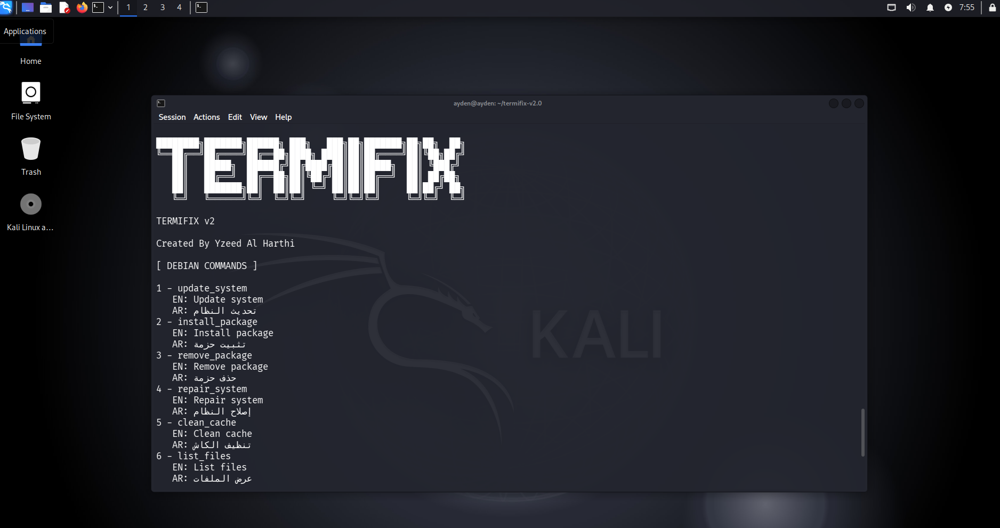

# TERMIFIX


##Version
v2.0

## Changelog

- Added language support (English / Arabic)
- Improved command system structure
- Added Linux basics guide
- Added password strength checker
- Fixed JSON structure issues
- Improved UI and output formatting


TERMIFIX is a lightweight Linux terminal assistant tool designed for Arch Linux and Debian/Ubuntu distributions.  
It helps users quickly search error messages on Google or execute predefined system commands.

---

## Features

- Search Linux errors directly on Google
- Run predefined system commands
- Supports Arch Linux and Debian/Ubuntu
- Auto-replaces <package_name> in commands
- Simple CLI interface

---

## Requirements

- Python 3.x
- colorama library

Install dependency:

```bash
pip install colorama

Installation

 1. Clone or download the project
 2. Place both files in the same folder:
 • termifixv2.py
 • commands.json
```
